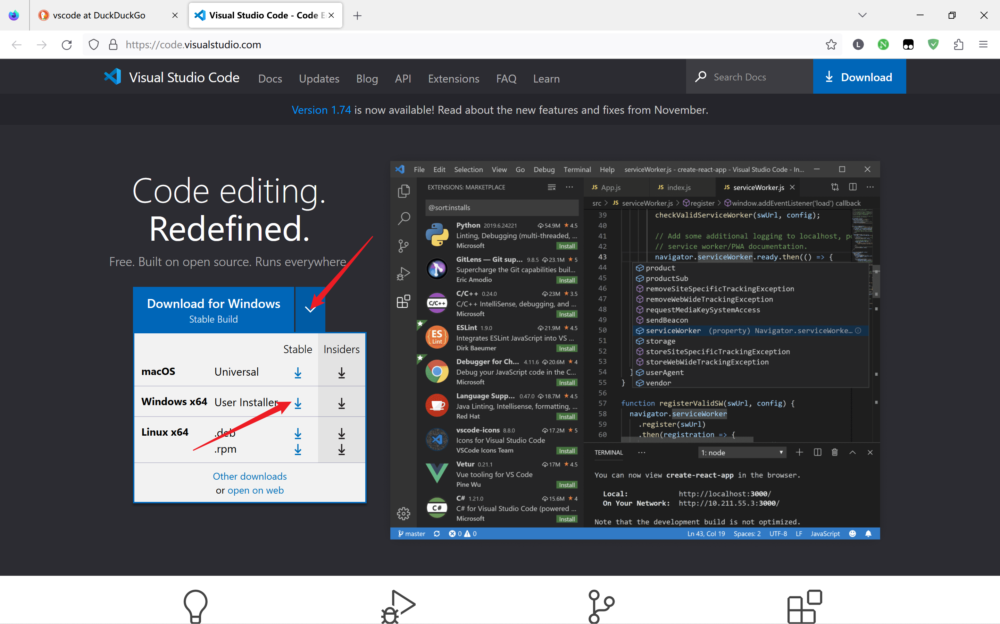
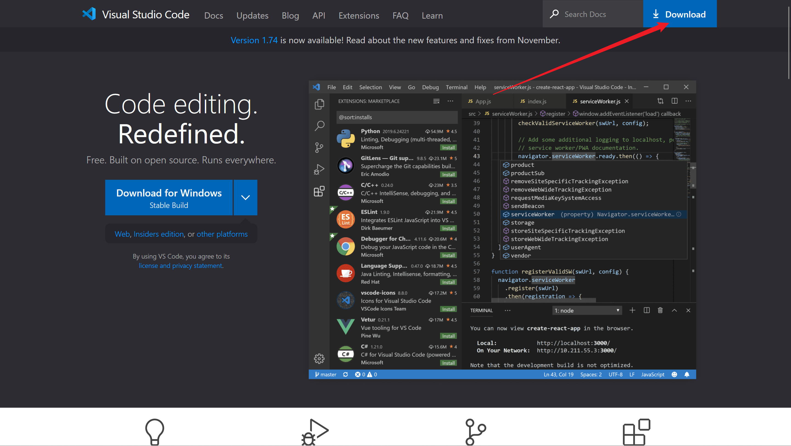
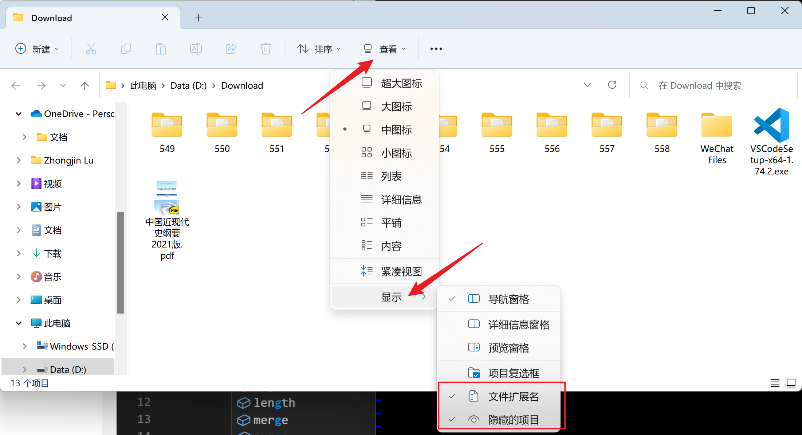
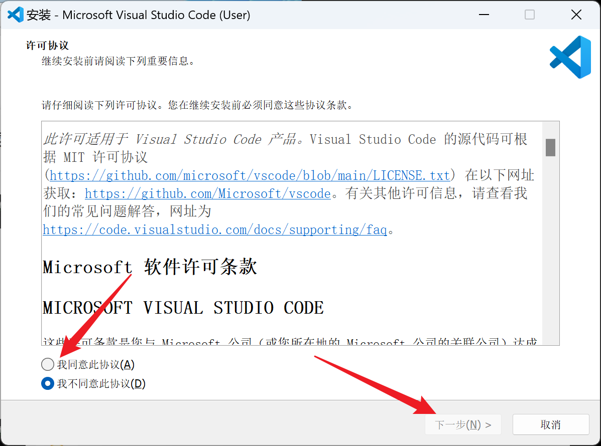

# 第一步

打开[vscode官网](https://code.visualstudio.com/)

常规的方法是这样

这样也可以，但是会默认安装给你这个用户(安装包名是 `User Installer`)，当之后你的电脑登录另一个账户的时候，就找不到这个软件了，所以更推荐大家使用以下安装方法

点击右上角 `Download`

然后选择 `System Installer x64`

下载安装包，在点击下载之后，会跳转 `Docs(Socunments) 文档` 页面，这里会介绍一些vscode的一些基础以及进阶操作，大家如果有兴趣可以学习一下，里面的内容正确性要比百度，知乎上面的答案更好，虽然浏览器有翻译功能，但是推荐大家读英文

**这里顺便给大家介绍一下，vscode是干啥的。我们写代码其实用记事本之类的也可以，但是vsocde有一些更加高端的功能，可以极大程度的提高我们写程序的效率，所以我们选择vscode**

# 第二步

双击打开安装包，后缀是 `exe(可执行程序)`，如果大家看不见文件的后缀，强烈建议大家打开这个功能，方法如下，以后会经常用到

打开之后是这个样子

同意此协议，下一步

然后安装位置，建议大家首先安装在不是c盘的那个盘，然后单独创建一个文件夹，只有c盘的话也单独创建一个文件夹，然后点击后面的浏览，选中自己创建的那个文件夹，下一步

下一步

然后到选择附加任务这一页，将下面四个选项全部勾选上，非常重要

然后下一步，没什么问题就可以安装了
